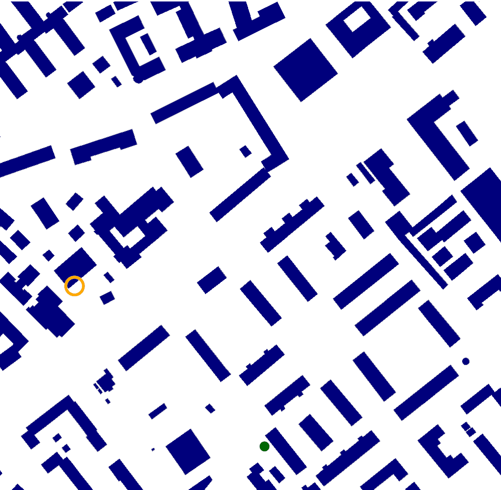
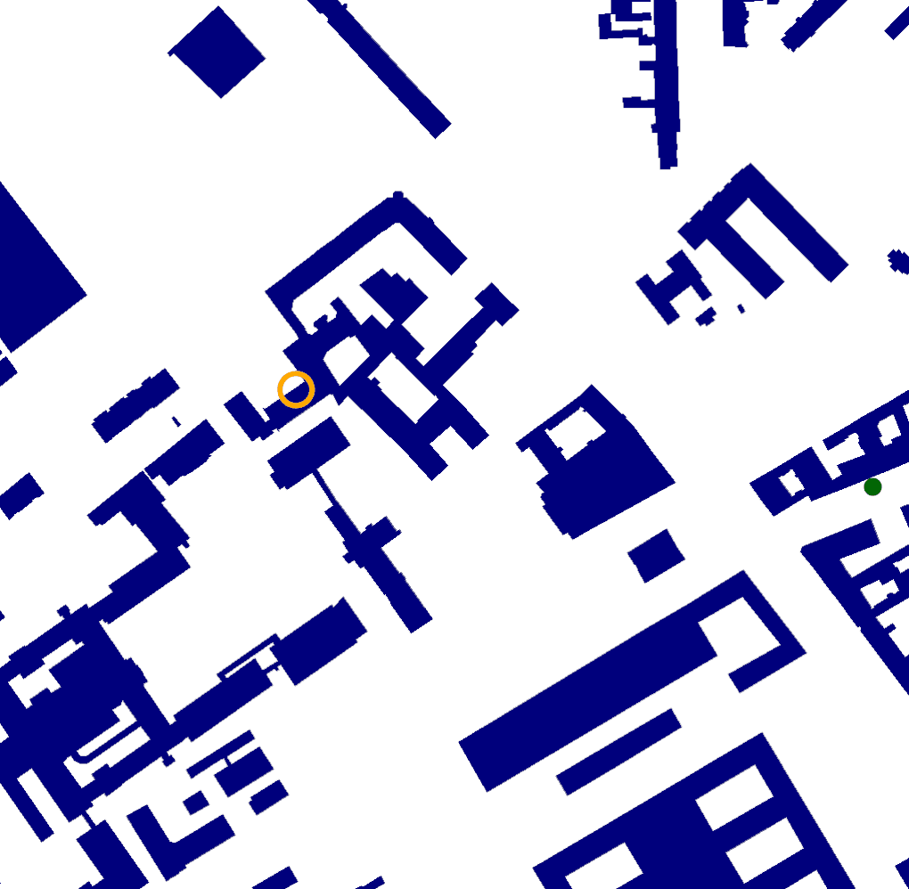
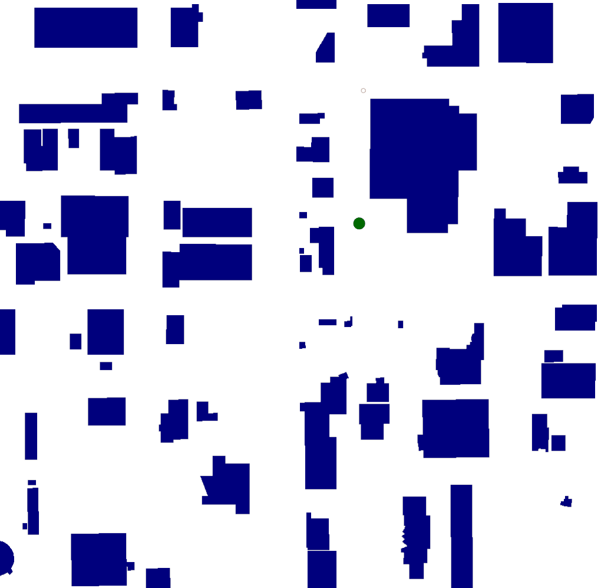
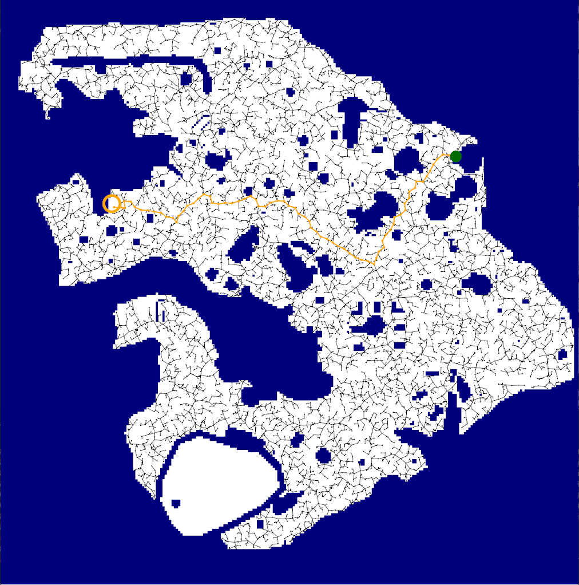
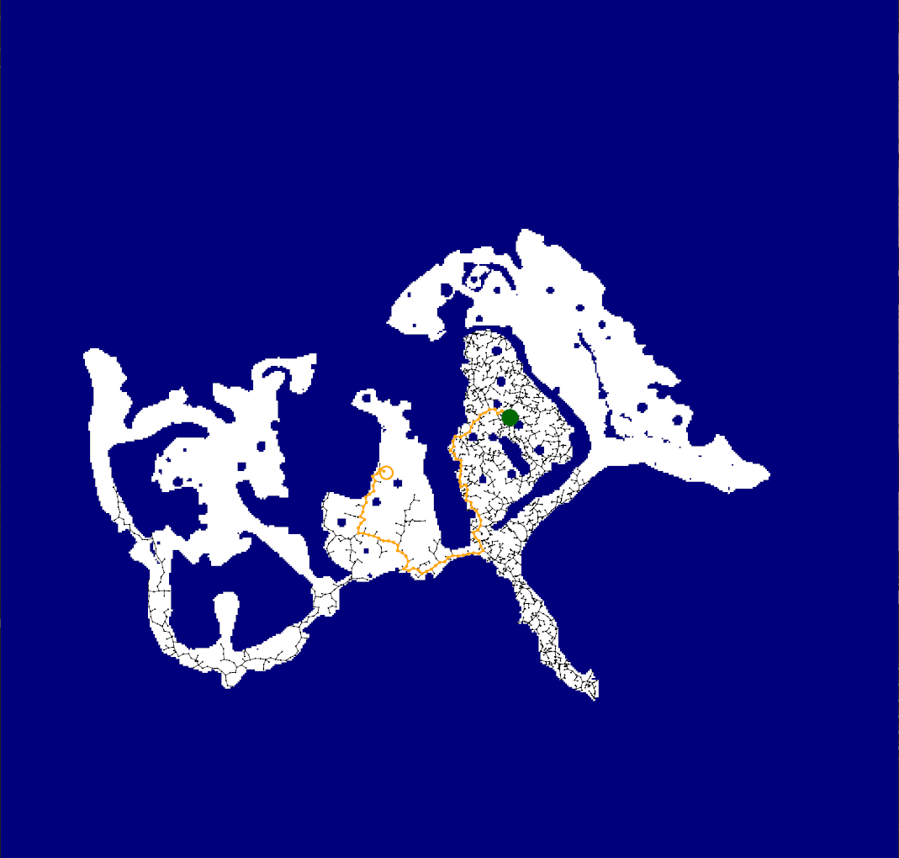
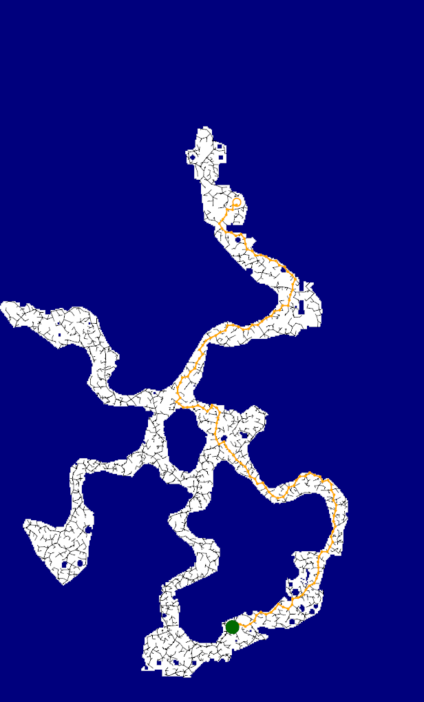
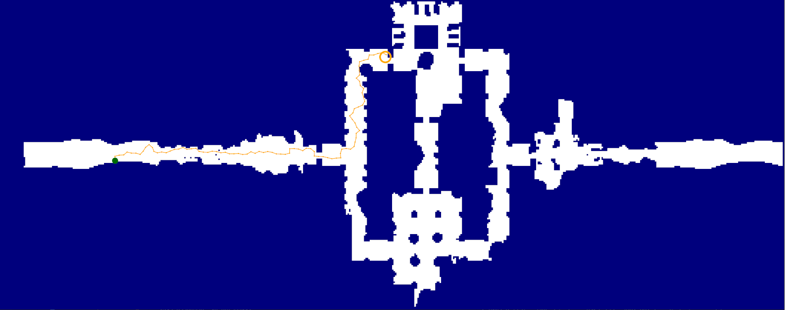
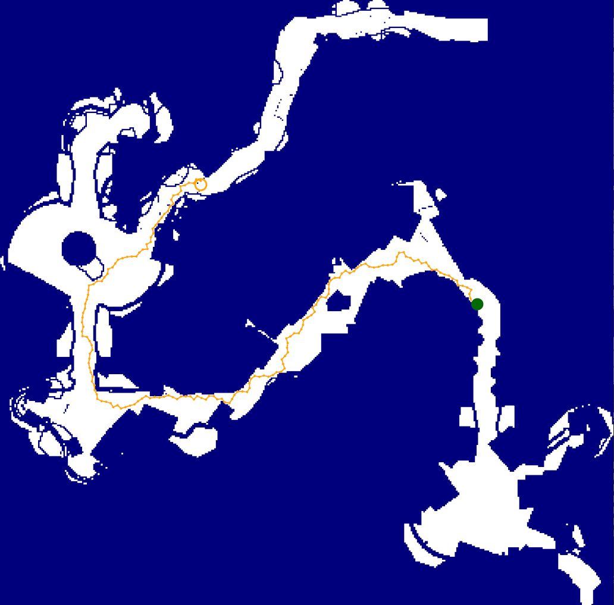
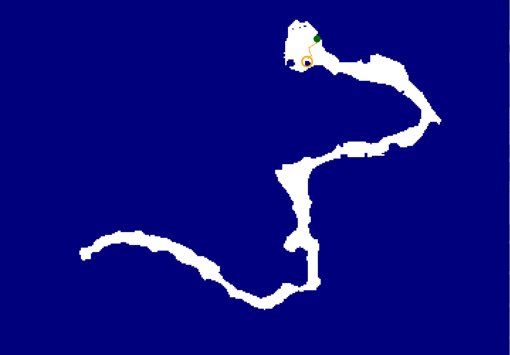

# PathPlanningAlgorithms(RRT, RRT*)

## Description

A software project at the Higher School of Economics. 
Pathfinding algorithms(at the moment, RRT algorithm implemented).

This project uses

- [pugixml](https://github.com/zeux/pugixml) - for parsing XML
- [nanoflann](https://github.com/jlblancoc/nanoflann) - kd tree, is used to find the n nearest neighbors and find the nearest neighbors in the radius
- [SFML](https://github.com/SFML/SFML) - to create a visualizer

## Installing

Download current repository to your local machine. Use

```bash
git clone https://github.com/Ch0p1k3/PathPlanningAlgorithms-RRT-RRTstar-
```

The project requires submodules, to install them use

```bash
cd PathPlanningAlgorithms-RRT-RRTstar-
git submodule init
git submodule update
```

## Input and output

### Input file

- Mandatory tag `root`. It describes the parameters.
  - Tag `map`. It describes the map.
    - `height` - the height of the field. A positive number.
    - `width` - the width of the field. A positive number.
    - `startx` - the start coordinate x. A number from `0` to `width - 1`.
    - `starty` - the start coordinate y. A number from `0` to `height - 1`.
    - `finishx` - the finish coordinate x. A number from `0` to `width - 1`.
    - `finishy` - the finish coordinate y. A number from `0` to `height - 1`.
    - Tag `grid` describes your map, where each line is separated by a `line` tag. `0` is free cell, `1` is obstruction.
  - Tag `algorithm` describes the algrithm options.
    - `searchtype` - the type of the search. Arguments are `rrt` or `rrtstar`. RRT and RRT* algorithm, respectively.
    - `numberofiterations` - number of iterations of the algorithm. In the case of RRT, if a path is found, the construction of the tree stops. In the case of RRT* algorithm will be improve path length. If you do not specify this tag, the default is set to 100000.
    - `stepsize` - maximum edge size in a tree. If you do not specify this tag, the default is set to 3. The value must be greater or equal than 1.
    - `eps` - error area the finish point. If you do not specify this tag, the default is set to 3. The value must be greater or equal than 1.
  - Tag `log` - specified output options. This is optional. If there are not the tag, the output file will be create in the same name and directory with suffix _log.
    - `path` - path to output file(with the name of file).

You can see an example of input data in the folder `tests`. [Sample](https://github.com/Ch0p1k3/PathPlanningAlgorithms-RRT-RRTstar-/blob/main/tests/sample/example.xml). In case of incorrect data, there may be undefined behavior.

### Output file

- Tag `root`. It describes the parameters.
  - `time` - algorithm running time.
  - `countofedges` - number of edges created.
  - `pathfound` - the tag that describes whether a path is found.
  - `distance` - length of the path found.
  - `path` - describes points of the path.

[Example of output data](https://github.com/Ch0p1k3/PathPlanningAlgorithms-RRT-RRTstar-/blob/main/tests/sample/example_log.xml).

## Getting started

To build and run the project you should have compiler on C++17 standart.

The project should be built with CMake.

Building and launching can be done both from the command line and using various IDEs. Below are the build and run scripts using the command line.

In order to build SFML on Linux, several libraries and their development headers need to be installed first. [Tutorial: Installing SFML dependencies.](https://github.com/SFML/SFML/wiki/Tutorial%3A-Installing-SFML-dependencies)

### Linux and Mac

**Release building**

```bash
cd PathPlanningAlgorithms-RRT-RRTstar-
cmake . -DCMAKE_BUILD_TYPE="Release" -Bbuild
cd build
make install
```

**Debug building**

```bash
cd PathPlanningAlgorithms-RRT-RRTstar-
cmake . -DCMAKE_BUILD_TYPE="Debug" -Bbuild
cd build
make install
```

### Windows

**Release building**

```cmd
cd PathPlanningAlgorithms-RRT-RRTstar-
cmake . -DCMAKE_BUILD_TYPE="Release" -Bbuild -G"MinGW Makefiles"
cd build
mingw32-make install
```

**Debug building**

```cmd
cd PathPlanningAlgorithms-RRT-RRTstar-
cmake . -DCMAKE_BUILD_TYPE="Debug" -Bbuild -G"MinGW Makefiles"
cd build
mingw32-make install
```

**Launching**

```bash
cd bin/{debug|release}/
./RRT-RRTstar <path to XML file> <args>
```

**Arguments**

In addition to the input data, there are arguments

- `-v` - launch with a visualizer that builds a tree online.
- `-va` - launch with a visualizer that will show the worked out algorithm at the end.
- `-vawt` - same as `-va`, but without the tree itself.
- `-secret` - just draws map, start and finish points.

If no arguments are specified, then the launch will be without a visualizer. All other arguments are ignored.

Argument priority

- `-secret`
- `-vawt`
- `-va`
- `-v`

That is, if a higher priority argument is specified, the others will be ignored.

## Visualizer

### Launch with visualizer

- `-v`




- `-va` - same as `-v`, but after working out the algorithm




- `-vawt`




## Mentors

Yakovlev Konstantin Sergeevich

- kyakovlev@hse.ru
- [HSE website](https://www.hse.ru/staff/yakovlev-ks)
- Telegram: @KonstantinYakovlev

Dergachev Stepan

- sadergachev@edu.hse.ru
- Telegram: @haiot4105

## Me

Luchsh Ivan

- Telegram: @ch0p1k3